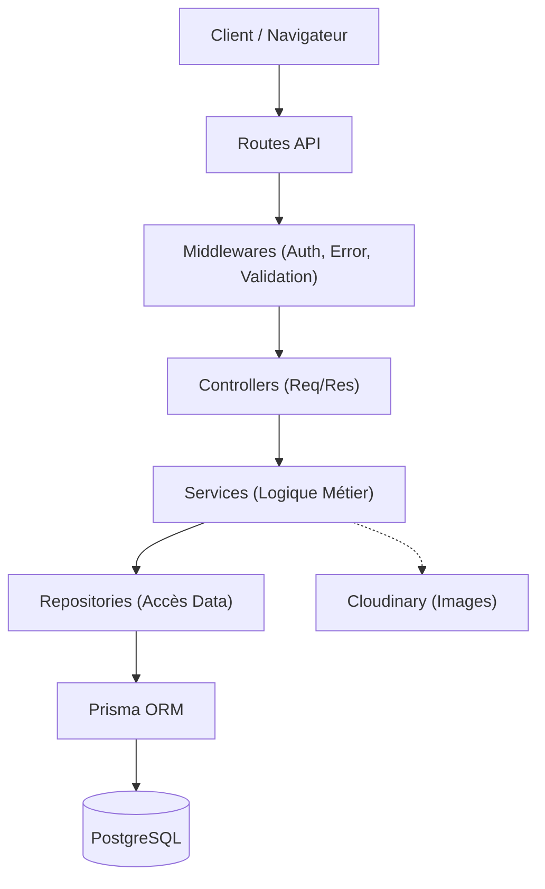
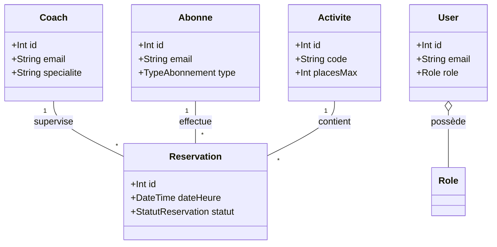
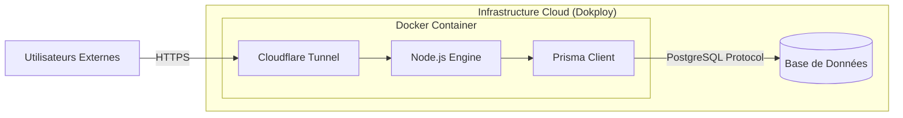

# Fitness 221 - Studio Management System

Ce projet est un système de gestion pour un studio de fitness, inspiré de l'architecture de **Ecole_Supérieure_221**.

## 🚀 Fonctionnalités principales

### 1. Gestion des Membres et du Staff
- **Coachs**: Gestion pour la planification des séances.
- **Abonnés**: Gestion des clients du studio.

### 2. Gestion des Activités
- **Activités**: Définition des séances de fitness (Musculation, Yoga, etc.) avec durée et capacité maximale.

### 3. Système de Réservation
- Réservation de séances par les abonnés.
- **Règles métier intelligentes**:
    - Validation de la disponibilité du coach (pas de double réservation).
    - Respect de la capacité maximale (`placesMax`) de l'activité.
    - Empêchement des doublons de réservation pour un même abonné.
    - Validation des dates (réservation uniquement dans le futur).

### 4. Sécurité JWT
- **Authentification**: Inscription et connexion sécurisées.
- **Protection des données**: Toutes les routes sensibles sont protégées par JWT.
- **Autorisation**: Les opérations administratives (création/modification) sont réservées au rôle `ADMIN`.

---

---

## 🏗️ Architecture Technique (Logicielle)

Le projet suit une architecture multicouche pour une maintenance facilitée :




### 📊 Diagramme de Relations (Données)




**Multiplicités :**
- **Coach (1) ↔ Reservation (*)** : Un coach peut superviser plusieurs réservations, mais une réservation est supervisée par un seul coach.
- **Abonné (1) ↔ Reservation (*)** : Un abonné peut effectuer plusieurs réservations, mais une réservation appartient à un seul abonné.
- **Activité (1) ↔ Reservation (*)** : Une activité peut faire l'objet de plusieurs réservations, mais une réservation concerne une seule activité.
- **User (1) ↔ Role (1)** : Un utilisateur possède un rôle unique (`ADMIN`, `COACH` ou `ABONNE`).

---

## ⚙️ Installation et Démarrage

1. **Installer les dépendances**:
   ```bash
   npm install
   ```

2. **Configurer l'environnement**:
   Créez un fichier `.env` à la racine (voir `.env.example` si disponible) avec:
   - `DATABASE_URL`
   - `JWT_SECRET`
   - `CLOUDINARY_URL` (optionnel)

3. **Générer le client Prisma**:
   ```bash
   npx prisma generate
   ```

4. **Exécuter les migrations**:
   ```bash
   npx prisma migrate dev
   ```

5. **Lancer le serveur**:
   ```bash
   npm run dev
   ```

---

## 📚 Documentation API (Swagger)

La documentation interactive de l'API est disponible à l'adresse suivante (lorsque le serveur est lancé):
[http://localhost:5000/api-docs](http://localhost:5000/api-docs)

---

## 🌐 Exposition Locale (Cloudflare Tunnel)

Pour exposer votre serveur local sur une URL HTTPS publique et aléatoire (très utile pour tester Swagger avec des collègues ou sur mobile) :

1. **Lancer le tunnel** :
   ```bash
   npm run tunnel
   ```

2. **Récupérer l'URL** : Copiez l'URL se terminant par `.trycloudflare.com` générée dans votre terminal.

3. **Configuration Swagger** : Pour que les tests API fonctionnent via cette URL, vous pouvez la définir dans votre `.env` :
   ```env
   APP_URL=https://votre-url-generee.trycloudflare.com
   ```

---


## 🧪 Guide de Test Rapide (Auth)

1. **S'inscrire (Admin)**:
   ```bash
   curl -X POST http://localhost:5000/api/auth/register \
     -H "Content-Type: application/json" \
     -d '{"email":"admin@fitness221.sn","password":"password123","role":"ADMIN"}'
   ```

2. **Se connecter**:
   ```bash
   curl -X POST http://localhost:5000/api/auth/login \
     -H "Content-Type: application/json" \
     -d '{"email":"admin@fitness221.sn","password":"password123"}'
   ```

3. **Accéder à une route protégée**:
   ```bash

---

## 🚀 Déploiement et Infrastructure

Le projet est optimisé pour être déployé sur **Dokploy** avec un support natif pour **Cloudflare Tunnel**.

### 🌐 Schéma de Déploiement



### 📦 Configuration Docker

L'application utilise un **Dockerfile multi-étape** basé sur `node:20-slim`. Le binaire **`cloudflared`** est automatiquement installé dans l'image de production.

### ⚙️ Variables d'Environnement (Dokploy)
Configurez ces variables dans l'interface de Dokploy :
- **`APP_URL`** : `http://localhost` (ou votre domaine réel). Indispensable pour Swagger.
- **`DATABASE_URL`** : URL de connexion à votre instance PostgreSQL.
- **`PORT`** : `5000`
- **`NODE_ENV`** : `production`
- **`CLOUDFLARE_TUNNEL_TOKEN`** : (Optionnel) Votre token Cloudflare Zero Trust pour une URL fixe.

### 🔄 Gestion des Processus (entrypoint.sh)
Le conteneur utilise un script d'entrée qui gère trois étapes :
1. **Migrations** : Exécution automatique de `npx prisma migrate deploy`.
2. **Tunnel** : Lancement de `cloudflared` (génère une URL aléatoire si aucun token n'est fourni).
3. **Application** : Démarrage du serveur Node.js.

### 📚 Accès et Documentation
- **URL Aléatoire** : Si vous n'utilisez pas de token, récupérez l'URL `.trycloudflare.com` dans l'onglet **Logs** de Dokploy au démarrage.
- **Swagger** : Accessible via `http://votre-domaine-ou-tunnel/api-docs`.
