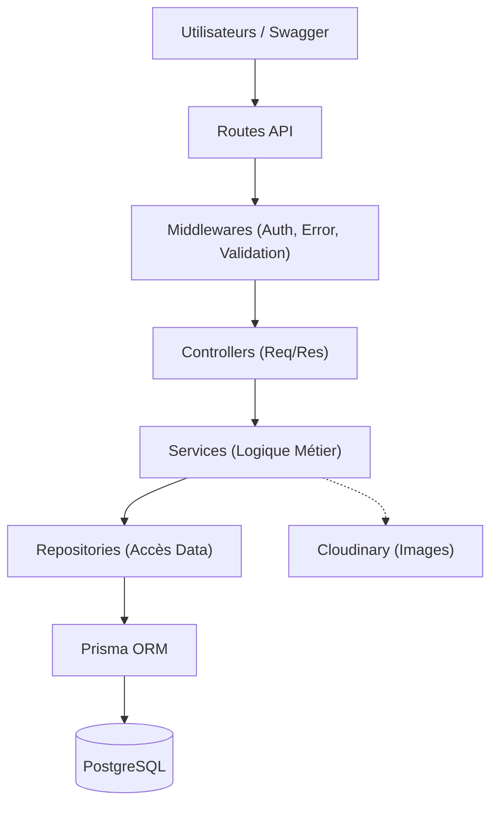

# 03 - Architecture Logicielle

## 🏗️ Architecture en Couches (Layered Architecture)
Le projet utilise une architecture multicouche pour séparer les responsabilités :
- **Routes** (`src/routes`) : Point d'entrée de l'API (Routage Express).
- **Controllers** (`src/controllers`) : Gestion des requêtes HTTP (Extraction des paramètres, Réponse).
- **Services** (`src/services`) : Logique métier complète (Règles de réservation, Calculs, Validations).
- **Repositories** (`src/repositories`) : Abstraction de l'accès aux données (Requêtes Prisma).
- **Modèle (Prisma Client)** : Interaction avec la base de données PostgreSQL.

## 🧩 Middlewares et Sécurité
### Authentification JWT
Le middleware `auth` vérifie chaque requête entrante. Il extrait le token, le valide et injecte l'expéditeur dans l'objet `req`.

### Gestion des Erreurs
Un middleware global `errorHandler` centralise toutes les exceptions de l'application, assurant que l'utilisateur reçoit toujours une réponse JSON cohérente et sécurisée.

### Validation Zod & Joi
L'utilisation de schémas de validation garantit que seules des données conformes entrent dans le système, évitant ainsi les erreurs inattendues en base de données.

---
[Précédent : Analyse Fonctionnelle](./02-analyse-fonctionnelle.md) | [Suivant : Conception des Données](./04-conception-donnees.md)
