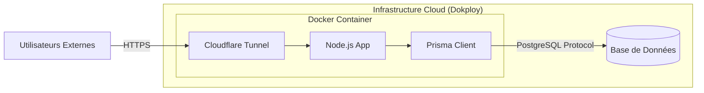

# 05 - Infrastructure et Déploiement

## 🐳 Conteneurisation (Docker)
L'application est entièrement conteneurisée pour garantir un environnement de production identique au développement.
### Dockerfile Multi-Stage
Nous utilisons une image **`node:20-slim`** pour assurer la légèreté et la compatibilité avec le moteur Prisma (OpenSSL inclus).
- **Stage 1 (Build)** : Installation de toutes les dépendances et génération du client Prisma.
- **Stage 2 (Production)** : Copie uniquement des fichiers nécessaires pour réduire la taille de l'image finale.

## 🚀 Déploiement sur Dokploy
Le projet est déployé en continu sur une instance **Dokploy**. Le cycle de vie est géré par un script `entrypoint.sh` :
1.  **Migrations** : Exécution automatique de `npx prisma migrate deploy`.
2.  **Tunnel** : Activation de `cloudflared` pour l'exposition publique.
3.  **Démarrage** : Lancement du serveur Node.js.

## 🌐 Exposition via Cloudflare Tunnel
Pour éviter d'exposer directement le serveur Dokploy et ses ports, nous utilisons un **Cloudflare Tunnel**. Cela permet :
- **HTTPS automatique** : Chiffrement de toutes les connexions.
- **Zero Trust** : Possibilité de restreindre l'accès à l'API.
- **Sécurité** : Aucun port ouvert directement sur le pare-feu du serveur.

---
[Précédent : Conception des Données](./04-conception-donnees.md) | [Suivant : Manuel d'Utilisation](./06-manuel-utilisation.md)
