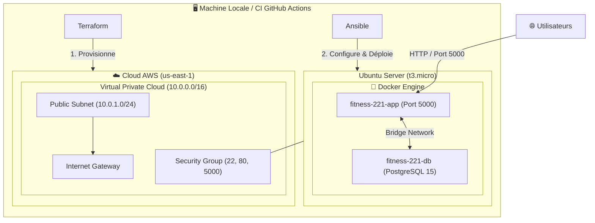
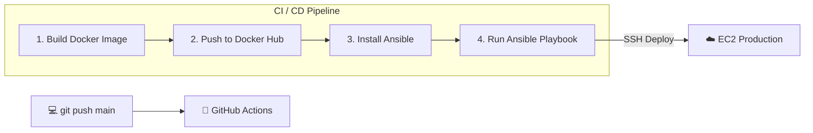

# 05 - Infrastructure et Déploiement

Cette section détaille l'infrastructure réseau et serveur de l'application **FITNESS 221**, ainsi que le pipeline d'intégration et de déploiement continus (CI/CD) entièrement automatisé avec **Terraform**, **Ansible**, et **GitHub Actions**.

---

## 🏗️ Architecture Globale

L'infrastructure repose sur un modèle d'infrastructure en tant que code (IaC) avec Terraform et de gestion de configuration automatisée avec Ansible.


```mermaid
flowchart TD
    subgraph Local["🖥️ Machine Locale / CI GitHub Actions"]
        T[Terraform] -->|1. Provisionne| AWS
        A[Ansible] -->|2. Configure & Déploie| EC2
    end

    subgraph AWS["☁️ Cloud AWS (us-east-1)"]
        subgraph VPC["Virtual Private Cloud (10.0.0.0/16)"]
            Subnet["Public Subnet (10.0.1.0/24)"]
            IGW["Internet Gateway"]
            SG["Security Group (22, 80, 5000)"]
            
            Subnet --> IGW
            
            subgraph EC2["Ubuntu Server (t3.micro)"]
                subgraph Docker["🐳 Docker Engine"]
                    AppCont["fitness-221-app (Port 5000)"]
                    DBCont["fitness-221-db (PostgreSQL 15)"]
                    AppCont <-->|Bridge Network| DBCont
                end
            end
            
            EC2 --- SG
        end
    end

    Internet[🌐 Utilisateurs] -->|HTTP / Port 5000| AppCont
```

---

## 🛠️ Infrastructure as Code (Terraform)

Le fichier **`main.tf`** décrit l'ensemble des ressources cloud requises sur AWS.

### Contenu de [`main.tf`](../main.tf)
- **Fournisseur AWS (`provider "aws"`)** : Configure la région de déploiement (`us-east-1`).
- **Réseau VPC & Subnet** : 
  - Crée un réseau isolé (`10.0.0.0/16`).
  - Configure un sous-réseau public (`10.0.1.0/24`) qui attribue automatiquement des adresses IP publiques aux instances.
- **Routage Internet** : 
  - Une *Internet Gateway* pour lier le VPC à internet.
  - Une table de routage publique associant le subnet à la Gateway.
- **Groupe de Sécurité (`aws_security_group`)** : Agit comme un pare-feu virtuel autorisant :
  - Le port `22` (SSH) pour Ansible et l'administration.
  - Le port `80` (HTTP standard).
  - Le port `5000` (Port de l'application Node.js).
- **Clé SSH (`aws_key_pair`)** : Enregistre la clé publique locale `my-ec2-key.pub` pour autoriser l'accès SSH sécurisé à l'instance.
- **Instance EC2 (`aws_instance`)** : Une machine virtuelle `t3.micro` sous Ubuntu 24.04 LTS. Elle contient un script d'initialisation (`user_data`) qui installe Docker et Docker Compose.
- **Provisionnement Ansible automatique (`terraform_data`)** : Déclenche l'exécution locale d'Ansible dès que l'instance EC2 est créée et que le délai d'initialisation de 30 secondes est écoulé.

---

## ⚙️ Automatisation et Configuration (Ansible)

Ansible prend le relais de Terraform pour préparer l'environnement applicatif et déployer les conteneurs sans aucune intervention manuelle.

Le dossier de configuration se structure ainsi :
```txt
ansible/
├── ansible.cfg                  # Configuration globale d'Ansible
├── playbook.yml                 # Playbook principal de déploiement
├── vars/
│   └── app.yml                  # Variables et secrets de l'application
└── templates/
    ├── .env.j2                  # Template dynamique pour le fichier .env
    └── docker-compose.yml.j2    # Template dynamique pour docker-compose.yml
```

### 1. Configuration globale : [`ansible.cfg`](../ansible/ansible.cfg)
Il configure Ansible pour désactiver la vérification stricte de l'empreinte SSH (`host_key_checking = False`), ce qui est nécessaire pour automatiser la première connexion sur un serveur fraîchement créé par Terraform.

### 2. Variables de déploiement : [`vars/app.yml`](../ansible/vars/app.yml)
Centralise les variables clés :
- Nom et port de l'application.
- Lien vers l'image Docker Hub (`smt197/fitness-221:latest`).
- Identifiants de la base de données PostgreSQL.
- Clés secrètes d'API (Cloudinary) et jeton JWT.

### 3. Fichiers Templates (Jinja2)
- **[`templates/.env.j2`](../ansible/templates/.env.j2)** : Génère le fichier `.env` de production avec les secrets et variables d'environnement injectés dynamiquement à partir de `vars/app.yml`.
- **[`templates/docker-compose.yml.j2`](../ansible/templates/docker-compose.yml.j2)** : Génère la structure Docker Compose de production. Contrairement au fichier de développement local, ce template n'inclut pas de directive `build` et récupère directement l'image compilée sur Docker Hub.

### 4. Playbook principal : [`playbook.yml`](../ansible/playbook.yml)
C'est le script orchestrant les tâches sur le serveur cible :
1. **`Attendre la connexion SSH`** : S'assure que le démon SSH de l'EC2 est actif et prêt à recevoir des commandes.
2. **`Attendre que Docker soit disponible`** : Patiente le temps que le script `user_data` de Terraform termine d'installer Docker.
3. **`Créer le dossier de l'application`** : Crée le répertoire `/home/ubuntu/fitness-221` avec les droits de l'utilisateur `ubuntu`.
4. **`Déployer les configurations`** : Copie et compile les templates `docker-compose.yml` et `.env`.
5. **`Lancer l'application`** : Effectue un `docker compose pull` pour récupérer la dernière image du Docker Hub, puis un `docker compose up -d` pour lancer les conteneurs en tâche de fond.
6. **`Nettoyer les images`** : Supprime les anciennes images inutilisées (`docker image prune`) pour éviter de saturer le stockage disque de la machine.

---

## 🔄 Intégration et Déploiement Continus (CI/CD GitHub Actions)

Le workflow défini dans **`.github/workflows/ci.yaml`** automatise le processus à chaque push sur la branche `main`.


```mermaid
flowchart LR
    Push["💻 git push main"] --> CI["🤖 GitHub Actions"]
    
    subgraph CI_Job["CI / CD Pipeline"]
        Build["1. Build Docker Image"] --> PushHub["2. Push to Docker Hub"]
        PushHub --> InstallAnsible["3. Install Ansible"]
        InstallAnsible --> RunPlaybook["4. Run Ansible Playbook"]
    end
    
    RunPlaybook -->|SSH Deploy| Server["☁️ EC2 Production"]
```

### Étapes clés du Pipeline :
1. **Build et Push Docker** : 
   - Se connecte à Docker Hub à l'aide des secrets de dépôt (`DOCKER_USERNAME` et `DOCKER_PASSWORD`).
   - Construit l'image Docker de production basée sur le [Dockerfile](../Dockerfile).
   - Tag l'image en `latest` ainsi qu'avec le hash du commit Git, puis la pousse sur le Docker Hub.
2. **Déploiement avec Ansible** :
   - Installe Ansible dans l'environnement temporaire de GitHub Actions.
   - Configure la clé SSH privée cryptée (`SSH_PRIVATE_KEY`) pour l'authentification avec la machine EC2.
   - Exécute le playbook Ansible `ansible/playbook.yml` sur l'IP publique du serveur en injectant l'IP dynamiquement.

---

[Précédent : Conception des Données](./04-conception-donnees.md) | [Suivant : Manuel d'Utilisation](./06-manuel-utilisation.md)
